# Frosh Tools

[](LICENSE.md)
[](https://www.shopware.com/)
[](https://packagist.org/packages/frosh/tools)

**Operator toolkit for Shopware 6** — health checks, cache & queue ops, security audits, logs, Elasticsearch tooling, and more, directly in the Administration.

Maintained by [FriendsOfShopware](https://friendsofshopware.com).  
Repository: [github.com/FriendsOfShopware/FroshTools](https://github.com/FriendsOfShopware/FroshTools)

---

## Why Frosh Tools?

Shopware shops accumulate operational work that usually needs SSH, Redis CLIs, Elasticsearch dashboards, or ad-hoc scripts. Frosh Tools brings those day-to-day tasks into the Admin under **Settings → Plugins → Tools**, so merchants and developers can inspect and act without leaving the browser.

| For operators | For developers |
| --- | --- |
| Clear caches & compile themes | System health + performance recommendations |
| Inspect queues and scheduled tasks | Feature flags, state machines, webhooks |
| Read production logs | Elasticsearch console & index lifecycle |
| Security overview + SBOM export | File integrity for core and extensions |
| Monitor tasks/queues via CLI mail alerts | Redis namespace/tag cleanup helpers |

Compatible with **Shopware 6.6 and 6.7**.

---

## Screenshots

Captured on Shopware 6.7 Administration (current UI).

### System Status

Live health checks (PHP, MySQL, queue, tasks, …) plus performance recommendations with documentation-oriented guidance.

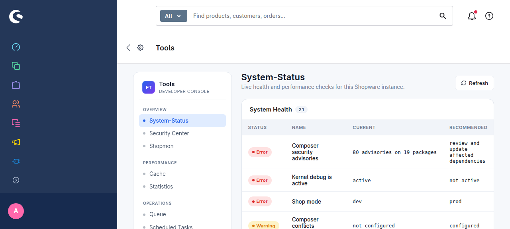

### Security Center

Dependency advisories, runtime end-of-life checks, configuration risks, file integrity — and **Export SBOM** (CycloneDX 1.7 from `composer.lock`).

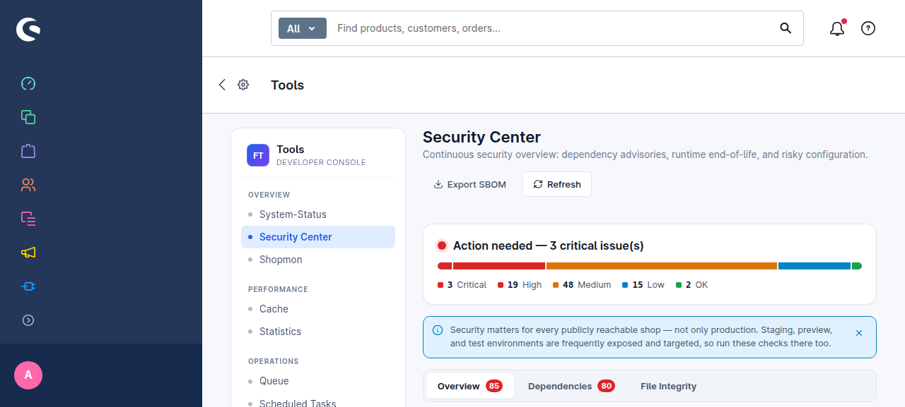

### Cache Manager

List cache pools, clear individual pools, compile the theme, and clear PHP OPcache.

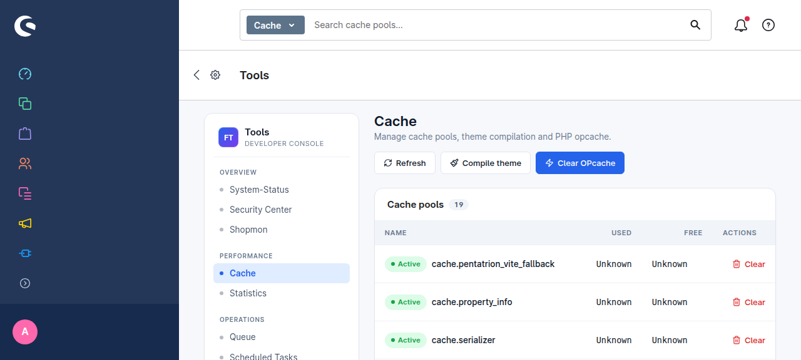

### Statistics

OPcache hit rate/memory, cache backend metrics, and database server statistics.

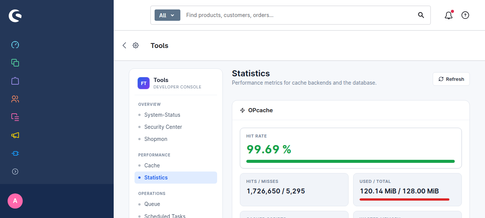

### Queue Manager

Transport overview (Doctrine, Redis, AMQP, …), message sizes, worker heartbeat, browse/retry/delete messages, purge or reset.

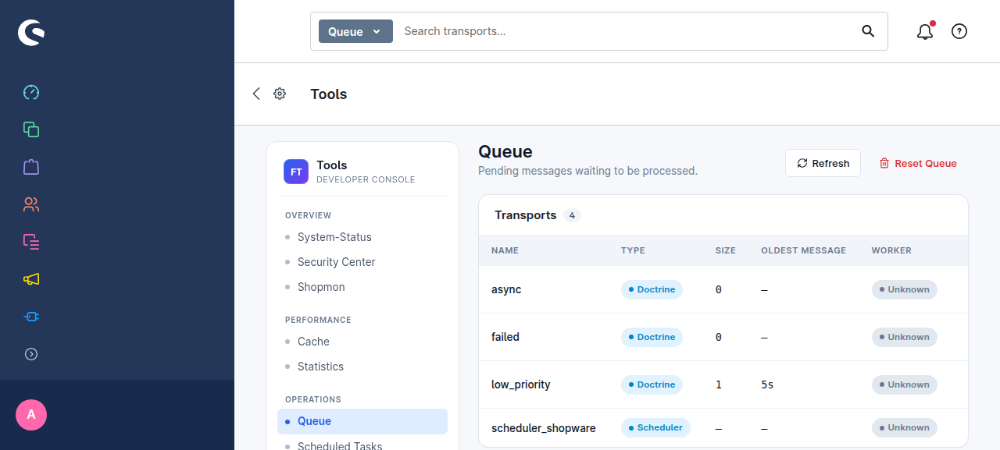

### Scheduled Tasks

Inspect all tasks, edit interval & next run, run a single task, register missing tasks.

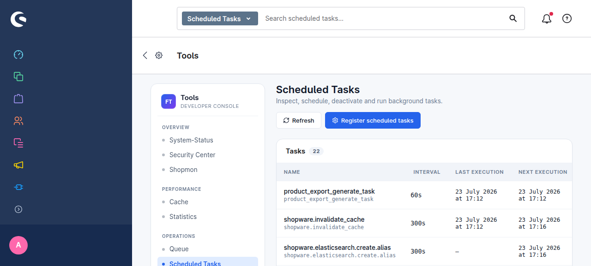

### State Machine Viewer

Interactive diagrams for order, payment, delivery, and other registered state machines.

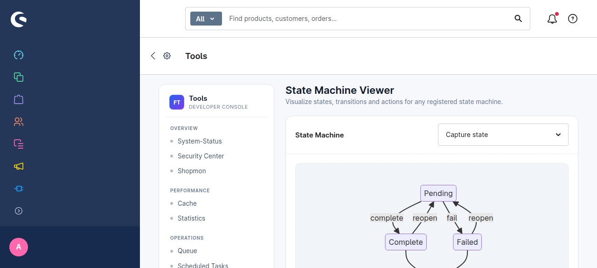

### Log Viewer

Browse any file under `var/log/` from the Admin.

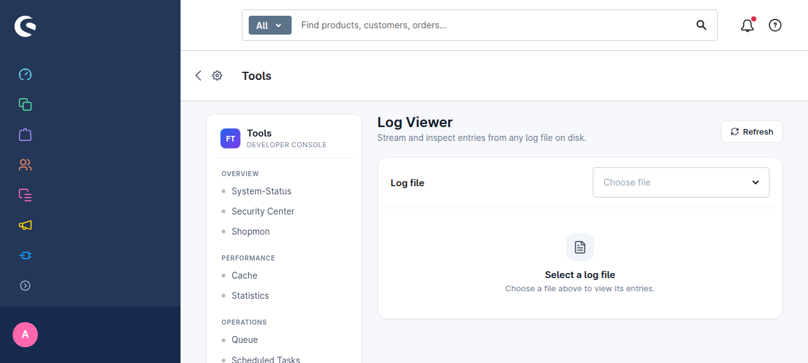

### Feature Flags

List core and extension feature flags; toggle where supported.

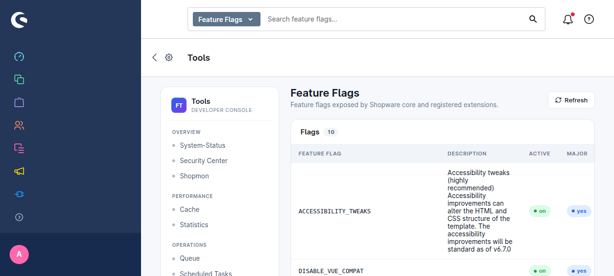

### Webhooks

Dedicated list/detail UI for Shopware webhooks (including inline search).

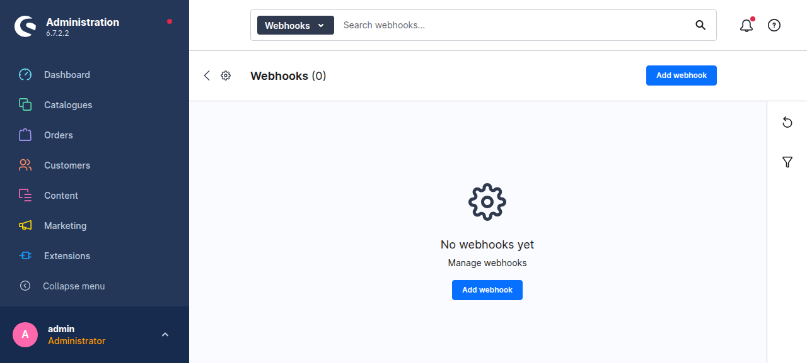

### Elasticsearch / OpenSearch

Cluster status, index list, reindex & alias actions, unused/orphaned index cleanup, and a low-level query console (when search is enabled).

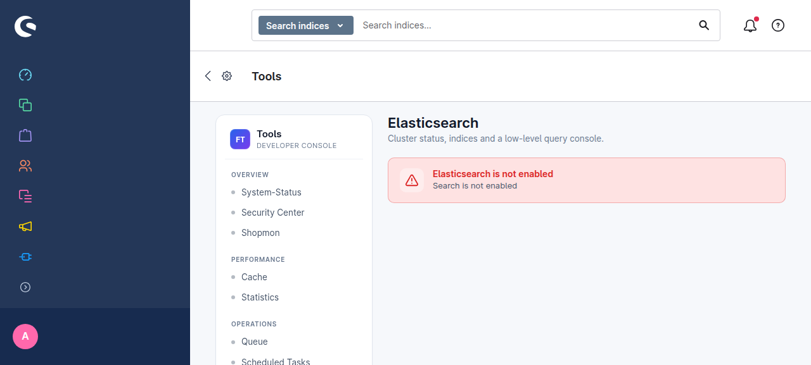

---

## Features

### Administration — Tools module

| Area | Capabilities |
| --- | --- |
| **System Status** | Health checkers (PHP/FPM, MySQL, queue lag, scheduled tasks, composer audit summary, debug/prod mode, …) and a large set of **performance recommendations** (admin worker, mail-over-queue, increment storage, OPcache flags, ES, product-stream indexing, …). |
| **Security Center** | Severity overview; Packagist dependency advisories; PHP / MySQL / Symfony / Shopware EOL; environment risks; **core & extension file integrity**; **CycloneDX 1.7 SBOM export**. |
| **Cache** | Pool listing with clear actions, theme compile, OPcache clear. |
| **Statistics** | OPcache, cache-adapter, and database metrics for capacity troubleshooting. |
| **Queue** | Multi-transport support (Doctrine, Redis, AMQP, fallback); browse without consuming (or fetch+requeue); retry failed messages; purge transport; reset queue. |
| **Scheduled Tasks** | List, run, deactivate; edit interval & next execution; register tasks. |
| **State Machines** | Diagram viewer for any registered state machine. |
| **Log Viewer** | Read `var/log/*.log` in the browser. |
| **Feature Flags** | Inspect and toggle flags from core/plugins. |
| **Elasticsearch** | Status, indices, reindex, alias switch, unused/orphaned cleanup, console. Optional `show_all_indices`. |
| **Fastly** | Purge all / by URL and basic stats when Fastly is configured. |
| **Shopmon** | Optional integration setup for external Shopmon monitoring. |
| **Webhooks** | Separate Admin module to create, search, and manage webhooks. |

### Status badge in the Admin header

The Shopware version indicator is extended with a compact **health status** (success / warning / error) so problems surface without opening Tools.

### Console commands

| Command | Purpose |
| --- | --- |
| `frosh:dev:robots-txt` | Block crawlers on test shops (`-r` to revert) |
| `frosh:composer-plugin:update` | Update Composer-managed plugins |
| `frosh:monitor <sales-channel-id>` | Email alert when queues/tasks exceed grace times |
| `frosh:es:delete-unused-indices` | Delete unused Elasticsearch indices |
| `frosh:extension:checksum:check [name]` | Verify extension file integrity |
| `frosh:extension:checksum:create [name]` | Create extension checksum manifests |
| `frosh:redis-namespace:list` | List Redis namespaces *(experimental)* |
| `frosh:redis-namespace:cleanup` | Clean Redis namespaces (`--dry-run` supported) *(experimental)* |
| `frosh:redis-tag:cleanup` | Clean Redis tags |
| `frosh:twig:warmup` | Warm Twig template cache |
| `frosh-tools:health-check-json` | Print merged health-check results as JSON (CI / monitoring) |

---

## Requirements

- Shopware **6.6** or **6.7**
- PHP version required by your Shopware minor
- Admin ACL privilege `frosh_tools:read` (and webhook privileges where applicable)

---

## Installation

### Composer (recommended)

```bash
composer require frosh/tools
bin/console plugin:refresh
bin/console plugin:install --activate FroshTools
bin/console cache:clear
```

### Shopware Store package

```bash
composer require store.shopware.com/froshtools
bin/console plugin:refresh
bin/console plugin:install --activate FroshTools
bin/console cache:clear
```

> Store installs need a valid `packages.shopware.com` Composer auth token.

### From Git (development)

```bash
git clone https://github.com/FriendsOfShopware/FroshTools.git custom/plugins/FroshTools
shopware-cli extension prepare custom/plugins/FroshTools
shopware-cli extension build custom/plugins/FroshTools
bin/console plugin:refresh
bin/console plugin:install --activate FroshTools
bin/console cache:clear
```

After activation, open **Settings → Plugins → Tools** (or search for “Tools” in the Admin).

---

## Configuration

Optional Symfony config — create `config/packages/frosh_tools.yaml`:

```yaml
frosh_tools:
    # Skip specific health/performance checkers by id (when needed)
    checker:
        disabled_checks: []

    # Paths that File Checker should not offer to restore
    file_checker:
        exclude_files:
            - vendor/shopware/core/FirstFile.php
            - vendor/shopware/core/SecondFile.php

    # Elasticsearch manager: list every index instead of only Shopware prefixes
    elasticsearch:
        show_all_indices: false
```

Plugin system config (Admin → Extensions → Frosh Tools):

- **Monitor mail address** — recipient for `frosh:monitor`
- **Queue grace time** (minutes) — when a queue is considered stuck
- **Task grace time** (minutes) — when a scheduled task is considered stuck

JSON Schema for IDE validation: [`frosh-tools-schema.json`](frosh-tools-schema.json).

---

## Monitoring & CI hooks

```bash
# Human-oriented mail alert (cron)
bin/console frosh:monitor <sales-channel-id>

# Machine-readable health snapshot
bin/console frosh-tools:health-check-json
```

Wire the JSON command into uptime checks, deploy gates, or external monitors. The Security Center **Export SBOM** action produces a CycloneDX 1.7 document suitable for dependency scanners.

---

## Development

```bash
# Format / static checks via shopware-cli (Docker)
composer format
composer check

# PHPUnit (from a Shopware project that requires this plugin)
composer phpunit
```

Admin sources live under `src/Resources/app/administration`. Rebuild with:

```bash
shopware-cli extension build custom/plugins/FroshTools
# or, from the Shopware root:
bin/build-administration.sh
```

---

## Links

- [GitHub Issues](https://github.com/FriendsOfShopware/FroshTools/issues) — bugs & feature requests  
- [FriendsOfShopware](https://friendsofshopware.com)  
- [Shopware Store listing](https://store.shopware.com/) (search “Frosh Tools”)  
- Maintainer: [Soner Sayakci (@shyim)](https://github.com/shyim)

---

## License

[MIT](LICENSE.md)
